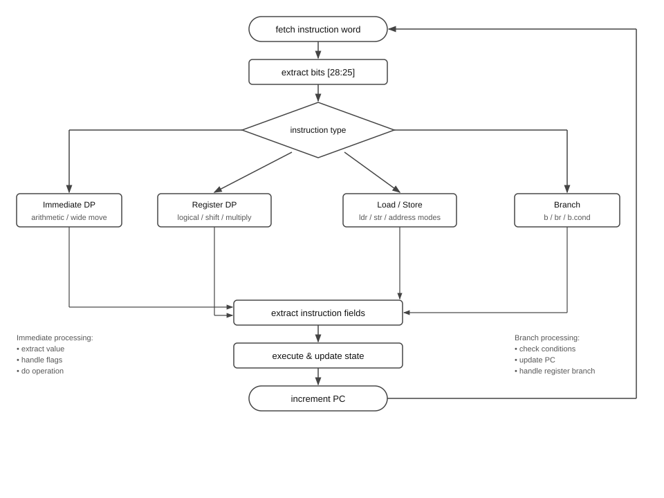
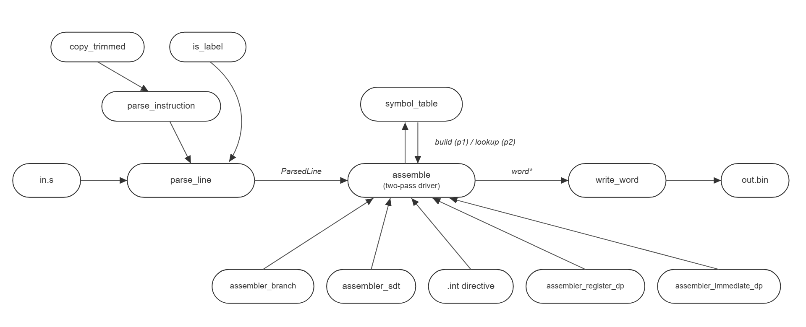

# ARMv8 emulator and assembler

A two-pass assembler and a fetch-decode-execute emulator for a subset of the AArch64 instruction set, written from scratch in C17 as a group project at Imperial College London.

The source stays private for academic integrity reasons, so this page is a description of how it works and how it was built. If you would like to see the code, the contact line at the end is there for that.

- `emulate` runs a raw binary on a simulated 64-bit ARM machine and prints the final registers, flags and non-zero memory.
- `assemble` turns AArch64 assembly source into the little-endian machine code that `emulate` (or a real Raspberry Pi) will run.

The machine has 31 general purpose registers, a program counter, the N, Z, C and V flags and 2 MiB of memory. The subset covers arithmetic, bit logic, multiplies, wide moves, loads and stores in five addressing modes, and unconditional, register and conditional branches. Anything else is rejected with an error rather than guessed at.

## Emulator

The machine is one struct holding the registers, PC, flags and memory. The run loop fetches a word, stops on the halt word `0x8a000000`, and otherwise hands it to `decode`, which dispatches on bits 28 to 25 and reports whether the instruction wrote the PC; if not, the loop adds 4.

<p align="center">
  
</p>

Register 31 reads as zero and swallows writes inside the register accessors, and every memory access is bounds-checked. The one exception is the Raspberry Pi GPIO window at `0x3f200000`, where a store is logged instead of stored.

## Assembler

Pass one records the address of every label; pass two encodes. The parser knows nothing about mnemonics. Each line goes to a table of encoder groups, one per instruction family, and the first encoder that accepts it wins.

<p align="center">
  
</p>

Aliases are rewritten into their base instruction and sent back through the ordinary encoder, so each bit layout exists once. Any failure prints the line number and a reason and exits non-zero.

## Supported instructions

| Category | Mnemonics |
|---|---|
| Arithmetic | `add`, `adds`, `sub`, `subs`, with an immediate or a shifted register |
| Bit logic | `and`, `ands`, `bic`, `bics`, `orr`, `orn`, `eor`, `eon`, with a shifted register |
| Wide move | `movn`, `movz`, `movk` |
| Multiply | `madd`, `msub` |
| Aliases | `cmp`, `cmn`, `tst`, `mov`, `mvn`, `neg`, `negs`, `mul`, `mneg` |
| Load and store | `ldr`, `str` in five addressing modes, plus PC-relative literals |
| Branch | `b`, `br`, `b.eq`, `b.ne`, `b.ge`, `b.lt`, `b.gt`, `b.le`, `b.al` |
| Directive | `.int`, one raw 32-bit word, which is also how a program halts |

## Sample program

```asm
movz x0, #6
movz x1, #7
mul  x2, x0, x1        ; x2 = 42
movz x3, #0x100
str  x2, [x3]          ; write it to address 0x100
.int 0x8a000000        ; halt
```

```bash
cd src && make
./assemble sample.s sample.bin
./emulate  sample.bin
# prints every register (x2 = 0x2a), the PC, PSTATE and the word at 0x100
```

## Raspberry Pi

The last part of the project was to write a program in this dialect, assemble it with our own assembler, and run it on real hardware. Our program configures GPIO pin 9 as an output and switches it on and off in a loop, blinking an LED. Because the emulator logs GPIO stores instead of storing them, the binary can be dry-run on a laptop before it is loaded on the Pi as a kernel image at boot.

## Engineering details

- **Build:** C17 with `-Wall -Werror -pedantic`, a hand-written Makefile, and no dependencies beyond the C standard library and POSIX.
- **Testing:** the module's test suite, unit tests for the shared helpers, leak checking, and a rule that nothing was merged unless it built clean.
- **Documentation:** every public function is documented in its header.

## Project stats

- 3,000 lines of C across 35 source and header files.
- Four Mathematics and Computer Science students, 240 commits on master, 59 of them merges, across more than 40 branches, over four weeks.
- Short-lived feature, fix, docs and refactor branches merged through merge requests, with `type: summary` commit messages throughout. The emulator was split by instruction family, then the split was reshuffled for the assembler so everyone touched both sides.

## Team

Sameer Khan, Brian Nwaghodoh, Sam Li and Neel Agrawal, Mathematics and Computer Science students at Imperial College London.

This page was written by Sameer Khan. If you would like to talk through any part of it, email smk25@ic.ac.uk.
